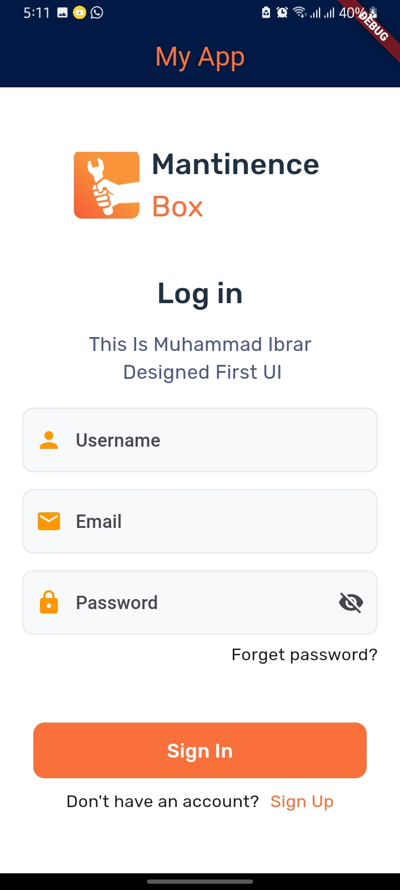

# TestApp

A new Flutter project showcasing a simple login UI design.

## Screenshot



## Getting started

This project is a starting point for a Flutter application.

### Prerequisites

Before you can run this project, make sure you have:

- Flutter SDK installed
- Android Studio or Visual Studio Code for development
- A connected physical device or emulator for testing

### Installing

1. Clone the repository:
   ```bash
   git clone <https://github.com/Muhammad-Ibrar727/First_UI_In_Flutter.git>
